<h2 align=center>Store Sales Analysis - Exploratory Data Analysis With Python and Pandas</h2>

### Libraries


```python
import pandas as pd
import numpy as np
import matplotlib.pyplot as plt
import seaborn as sns
#import calmap
```


**Context**

The growth of supermarkets in most populated cities are increasing and market competitions are also high. The dataset is one of the historical sales of supermarket company which has recorded in 3 different branches for 3 months data.

**Data Dictionary**

1. ***Invoice id:*** Computer generated sales slip invoice identification number

2. ***Branch:*** Branch of supercenter (3 branches are available identified by A, B and C).

3. ***City:*** Location of supercenters

4. ***Customer type:*** Type of customers, recorded by Members for customers using member card and Normal for without member card.

5. ***Gender:*** Gender type of customer

6. ***Product line:*** General item categorization groups - Electronic accessories, Fashion accessories, Food and beverages, Health and beauty, Home and lifestyle, Sports and travel

7. ***Unit price:*** Price of each product in USD

8. ***Quantity:*** Number of products purchased by customer

9. ***Tax:*** 5% tax fee for customer buying

10. ***Total:*** Total price including tax

11. ***Date:*** Date of purchase (Record available from January 2019 to March 2019)

12. ***Time:*** Purchase time (10am to 9pm)

13. ***Payment:*** Payment used by customer for purchase (3 methods are available – Cash, Credit card and Ewallet)

14. ***COGS:*** Cost of goods sold

15. ***Gross margin percentage:*** Gross margin percentage

16. ***Gross income:*** Gross income

17. ***Rating:*** Customer stratification rating on their overall shopping experience (On a scale of 1 to 10)

### Initial Data Exploration


```python
df = pd.read_csv('supermarket_sales.csv')
```


```python
df
```


<div>

<table border="1" class="dataframe">
  <thead>
    <tr style="text-align: right;">
      <th></th>
      <th>Invoice ID</th>
      <th>Branch</th>
      <th>City</th>
      <th>Customer type</th>
      <th>Gender</th>
      <th>Product line</th>
      <th>Unit price</th>
      <th>Quantity</th>
      <th>Tax 5%</th>
      <th>Total</th>
      <th>Date</th>
      <th>Time</th>
      <th>Payment</th>
      <th>cogs</th>
      <th>gross margin percentage</th>
      <th>gross income</th>
      <th>Rating</th>
    </tr>
  </thead>
  <tbody>
    <tr>
      <th>0</th>
      <td>750-67-8428</td>
      <td>A</td>
      <td>Yangon</td>
      <td>Member</td>
      <td>Female</td>
      <td>Health and beauty</td>
      <td>74.69</td>
      <td>7.0</td>
      <td>26.1415</td>
      <td>548.9715</td>
      <td>1/5/19</td>
      <td>13:08</td>
      <td>Ewallet</td>
      <td>522.83</td>
      <td>4.761905</td>
      <td>26.1415</td>
      <td>9.1</td>
    </tr>
    <tr>
      <th>1</th>
      <td>226-31-3081</td>
      <td>C</td>
      <td>Naypyitaw</td>
      <td>Normal</td>
      <td>Female</td>
      <td>Electronic accessories</td>
      <td>15.28</td>
      <td>5.0</td>
      <td>3.8200</td>
      <td>80.2200</td>
      <td>3/8/19</td>
      <td>10:29</td>
      <td>Cash</td>
      <td>76.40</td>
      <td>4.761905</td>
      <td>3.8200</td>
      <td>9.6</td>
    </tr>
    <tr>
      <th>2</th>
      <td>631-41-3108</td>
      <td>A</td>
      <td>Yangon</td>
      <td>Normal</td>
      <td>Male</td>
      <td>Home and lifestyle</td>
      <td>46.33</td>
      <td>7.0</td>
      <td>16.2155</td>
      <td>340.5255</td>
      <td>3/3/19</td>
      <td>13:23</td>
      <td>Credit card</td>
      <td>324.31</td>
      <td>4.761905</td>
      <td>16.2155</td>
      <td>7.4</td>
    </tr>
    <tr>
      <th>3</th>
      <td>123-19-1176</td>
      <td>A</td>
      <td>Yangon</td>
      <td>Member</td>
      <td>Male</td>
      <td>Health and beauty</td>
      <td>58.22</td>
      <td>8.0</td>
      <td>23.2880</td>
      <td>489.0480</td>
      <td>1/27/19</td>
      <td>20:33</td>
      <td>Ewallet</td>
      <td>465.76</td>
      <td>4.761905</td>
      <td>23.2880</td>
      <td>8.4</td>
    </tr>
    <tr>
      <th>4</th>
      <td>373-73-7910</td>
      <td>A</td>
      <td>Yangon</td>
      <td>Normal</td>
      <td>Male</td>
      <td>Sports and travel</td>
      <td>86.31</td>
      <td>7.0</td>
      <td>30.2085</td>
      <td>634.3785</td>
      <td>2/8/19</td>
      <td>10:37</td>
      <td>Ewallet</td>
      <td>604.17</td>
      <td>4.761905</td>
      <td>30.2085</td>
      <td>5.3</td>
    </tr>
    <tr>
      <th>...</th>
      <td>...</td>
      <td>...</td>
      <td>...</td>
      <td>...</td>
      <td>...</td>
      <td>...</td>
      <td>...</td>
      <td>...</td>
      <td>...</td>
      <td>...</td>
      <td>...</td>
      <td>...</td>
      <td>...</td>
      <td>...</td>
      <td>...</td>
      <td>...</td>
      <td>...</td>
    </tr>
    <tr>
      <th>998</th>
      <td>347-56-2442</td>
      <td>A</td>
      <td>Yangon</td>
      <td>Normal</td>
      <td>Male</td>
      <td>Home and lifestyle</td>
      <td>65.82</td>
      <td>1.0</td>
      <td>3.2910</td>
      <td>69.1110</td>
      <td>2/22/19</td>
      <td>15:33</td>
      <td>Cash</td>
      <td>65.82</td>
      <td>4.761905</td>
      <td>3.2910</td>
      <td>4.1</td>
    </tr>
    <tr>
      <th>999</th>
      <td>849-09-3807</td>
      <td>A</td>
      <td>Yangon</td>
      <td>Member</td>
      <td>Female</td>
      <td>Fashion accessories</td>
      <td>88.34</td>
      <td>7.0</td>
      <td>30.9190</td>
      <td>649.2990</td>
      <td>2/18/19</td>
      <td>13:28</td>
      <td>Cash</td>
      <td>618.38</td>
      <td>4.761905</td>
      <td>30.9190</td>
      <td>6.6</td>
    </tr>
    <tr>
      <th>1000</th>
      <td>849-09-3807</td>
      <td>A</td>
      <td>Yangon</td>
      <td>Member</td>
      <td>Female</td>
      <td>Fashion accessories</td>
      <td>88.34</td>
      <td>7.0</td>
      <td>30.9190</td>
      <td>649.2990</td>
      <td>2/18/19</td>
      <td>13:28</td>
      <td>Cash</td>
      <td>618.38</td>
      <td>4.761905</td>
      <td>30.9190</td>
      <td>6.6</td>
    </tr>
    <tr>
      <th>1001</th>
      <td>745-74-0715</td>
      <td>A</td>
      <td>Yangon</td>
      <td>Normal</td>
      <td>Male</td>
      <td>Electronic accessories</td>
      <td>NaN</td>
      <td>2.0</td>
      <td>5.8030</td>
      <td>121.8630</td>
      <td>3/10/19</td>
      <td>20:46</td>
      <td>Ewallet</td>
      <td>116.06</td>
      <td>4.761905</td>
      <td>5.8030</td>
      <td>8.8</td>
    </tr>
    <tr>
      <th>1002</th>
      <td>452-04-8808</td>
      <td>B</td>
      <td>Mandalay</td>
      <td>Normal</td>
      <td>Male</td>
      <td>Electronic accessories</td>
      <td>87.08</td>
      <td>NaN</td>
      <td>30.4780</td>
      <td>640.0380</td>
      <td>1/26/19</td>
      <td>15:17</td>
      <td>Cash</td>
      <td>609.56</td>
      <td>4.761905</td>
      <td>30.4780</td>
      <td>5.5</td>
    </tr>
  </tbody>
</table>
<p>1003 rows × 17 columns</p>
</div>


```python
df.columns
```


    Index(['Invoice ID', 'Branch', 'City', 'Customer type', 'Gender',
           'Product line', 'Unit price', 'Quantity', 'Tax 5%', 'Total', 'Date',
           'Time', 'Payment', 'cogs', 'gross margin percentage', 'gross income',
           'Rating'],
          dtype='object')


```python
df.dtypes
```


    Invoice ID                  object
    Branch                      object
    City                        object
    Customer type               object
    Gender                      object
    Product line                object
    Unit price                 float64
    Quantity                   float64
    Tax 5%                     float64
    Total                      float64
    Date                        object
    Time                        object
    Payment                     object
    cogs                       float64
    gross margin percentage    float64
    gross income               float64
    Rating                     float64
    dtype: object


```python
df['Date'] = pd.to_datetime(df['Date'])
```

    C:\Users\Admin-$\AppData\Local\Temp\ipykernel_11832\2394721818.py:1: UserWarning: Could not infer format, so each element will be parsed individually, falling back to `dateutil`. To ensure parsing is consistent and as-expected, please specify a format.
      df['Date'] = pd.to_datetime(df['Date'])
    


```python
df.set_index('Date', inplace=True)
```


```python
df.describe()
```


<div>

<table border="1" class="dataframe">
  <thead>
    <tr style="text-align: right;">
      <th></th>
      <th>Unit price</th>
      <th>Quantity</th>
      <th>Tax 5%</th>
      <th>Total</th>
      <th>cogs</th>
      <th>gross margin percentage</th>
      <th>gross income</th>
      <th>Rating</th>
    </tr>
  </thead>
  <tbody>
    <tr>
      <th>count</th>
      <td>996.000000</td>
      <td>983.000000</td>
      <td>1003.000000</td>
      <td>1003.000000</td>
      <td>1003.000000</td>
      <td>1.003000e+03</td>
      <td>1003.000000</td>
      <td>1003.000000</td>
    </tr>
    <tr>
      <th>mean</th>
      <td>55.764568</td>
      <td>5.501526</td>
      <td>15.400368</td>
      <td>323.407726</td>
      <td>308.007358</td>
      <td>4.761905e+00</td>
      <td>15.400368</td>
      <td>6.972682</td>
    </tr>
    <tr>
      <th>std</th>
      <td>26.510165</td>
      <td>2.924673</td>
      <td>11.715192</td>
      <td>246.019028</td>
      <td>234.303836</td>
      <td>8.886215e-16</td>
      <td>11.715192</td>
      <td>1.717647</td>
    </tr>
    <tr>
      <th>min</th>
      <td>10.080000</td>
      <td>1.000000</td>
      <td>0.508500</td>
      <td>10.678500</td>
      <td>10.170000</td>
      <td>4.761905e+00</td>
      <td>0.508500</td>
      <td>4.000000</td>
    </tr>
    <tr>
      <th>25%</th>
      <td>33.125000</td>
      <td>3.000000</td>
      <td>5.894750</td>
      <td>123.789750</td>
      <td>117.895000</td>
      <td>4.761905e+00</td>
      <td>5.894750</td>
      <td>5.500000</td>
    </tr>
    <tr>
      <th>50%</th>
      <td>55.420000</td>
      <td>5.000000</td>
      <td>12.096000</td>
      <td>254.016000</td>
      <td>241.920000</td>
      <td>4.761905e+00</td>
      <td>12.096000</td>
      <td>7.000000</td>
    </tr>
    <tr>
      <th>75%</th>
      <td>78.085000</td>
      <td>8.000000</td>
      <td>22.539500</td>
      <td>473.329500</td>
      <td>450.790000</td>
      <td>4.761905e+00</td>
      <td>22.539500</td>
      <td>8.500000</td>
    </tr>
    <tr>
      <th>max</th>
      <td>99.960000</td>
      <td>10.000000</td>
      <td>49.650000</td>
      <td>1042.650000</td>
      <td>993.000000</td>
      <td>4.761905e+00</td>
      <td>49.650000</td>
      <td>10.000000</td>
    </tr>
  </tbody>
</table>
</div>


 

### Univariate Analysis

**Question 1:** What does the distribution of customer ratings looks like? Is it skewed?


```python
sns.displot(df['Rating'])
plt.axvline(x=np.mean(df['Rating']), c='red', ls='--', label = 'mean')
plt.axvline(x=np.percentile(df['Rating'],25),c='blue', ls='--', label = '25-75th percentile')
plt.axvline(x=np.percentile(df['Rating'],75),c='blue', ls='--')
plt.legend()
```


    <matplotlib.legend.Legend at 0x20ad38a7350>


    
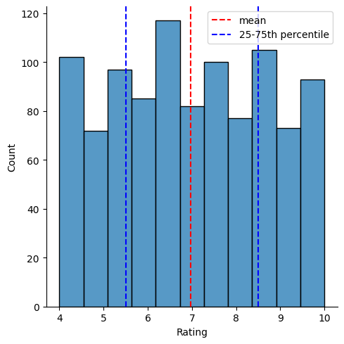
    


**Distribution of Customer Ratings**

- Chart: Distribution plot with mean and quartiles.
- Observation: The customer ratings are normally distributed with a mean around 7. The red dashed line indicates the mean, while blue dashed lines represent the 25th and 75th percentiles.
- Insight: This normal distribution suggests that most customers have a satisfactory experience, as ratings cluster around the mean.


```python
df.hist(figsize=(10,10))
```


    array([[<Axes: title={'center': 'Unit price'}>,
            <Axes: title={'center': 'Quantity'}>,
            <Axes: title={'center': 'Tax 5%'}>],
           [<Axes: title={'center': 'Total'}>,
            <Axes: title={'center': 'cogs'}>,
            <Axes: title={'center': 'gross margin percentage'}>],
           [<Axes: title={'center': 'gross income'}>,
            <Axes: title={'center': 'Rating'}>, <Axes: >]], dtype=object)


    
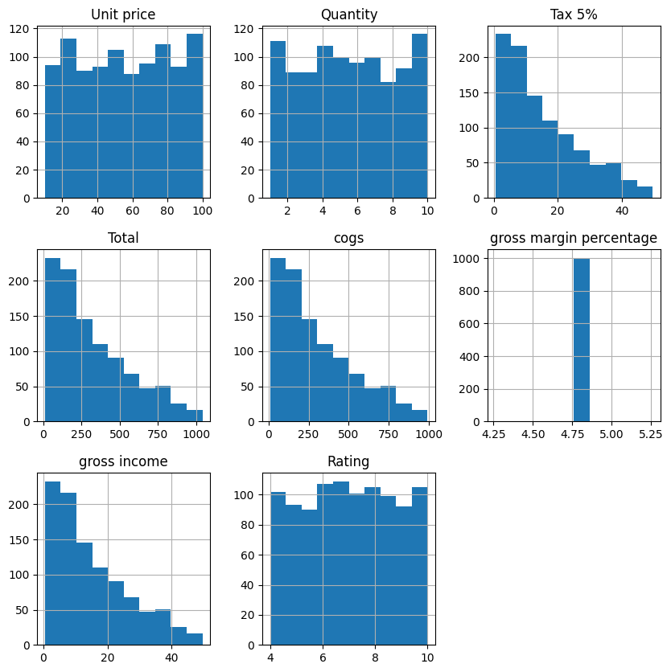
    


**Question 2:** Do aggregate sales numbers differ by much between branches?


```python
print(df['Branch'].value_counts())
sns.countplot(x= df['Branch'], data=df, orient='h',hue=df['Branch'] )
```

    Branch
    A    342
    B    333
    C    328
    Name: count, dtype: int64
    


    <Axes: xlabel='Branch', ylabel='count'>


    
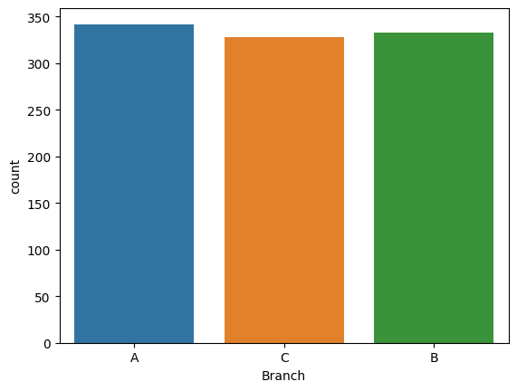
    


**Aggregate Sales Numbers by Branch**

- Chart: Count plot for branch sales.
- Observation: Branch A has the highest number of sales, followed closely by Branches B and C.
- Insight: Branch A might be more popular or located in a more densely populated area, leading to higher sales.


```python
print(df['Payment'].value_counts())
sns.countplot(x= df['Payment'], data=df, orient='h', hue=df['Payment'])
```

    Payment
    Ewallet        346
    Cash           346
    Credit card    311
    Name: count, dtype: int64
    


    <Axes: xlabel='Payment', ylabel='count'>


    
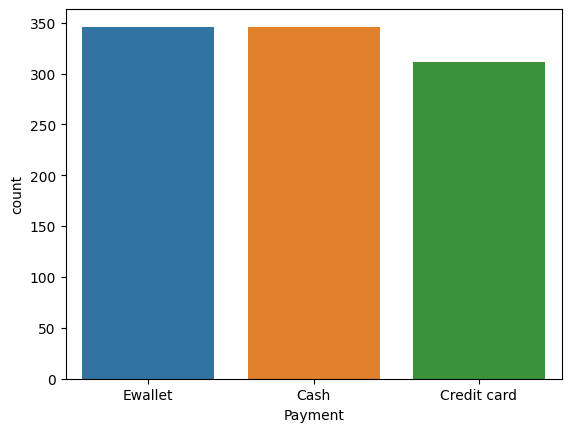
    


**Payment Method Distribution**

- Chart: Count plot for payment methods.
- Observation: Ewallet and Cash are equally popular, with Credit Card being slightly less used.
- Insight: The equal preference for Ewallet and Cash indicates a diverse customer base in terms of payment preferences.

  

### Bivariate Analysis

**Question 3:** Is there a relationship between gross income and customer ratings?


```python
#sns.scatterplot(x='Rating', y='gross income', data=df)
sns.regplot(x='Rating', y='gross income', data=df)
```


    <Axes: xlabel='Rating', ylabel='gross income'>


    
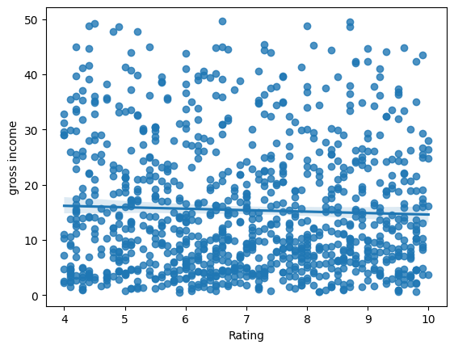
    


**Relationship Between Gross Income and Customer Ratings**

- Chart: Regression plot.
- Observation: There is no significant relationship between gross income and customer ratings.
- Insight: Customer satisfaction does not directly correlate with the amount spent, suggesting other factors influence ratings.


```python
sns.boxplot(x='Branch', y='gross income', data=df, hue='Branch')
```


    <Axes: xlabel='Branch', ylabel='gross income'>


    
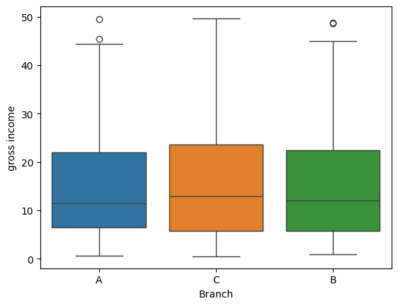
    


**Gross Income by Branch**

- Chart: Box plot.
- Observation: Gross income distributions are similar across branches, with Branch c having a slightly higher median.
- Insight: All branches perform similarly in terms of income, indicating a balanced performance.


```python
sns.boxplot(x='Gender', y='gross income',data=df, hue='Gender')
```


    <Axes: xlabel='Gender', ylabel='gross income'>


    
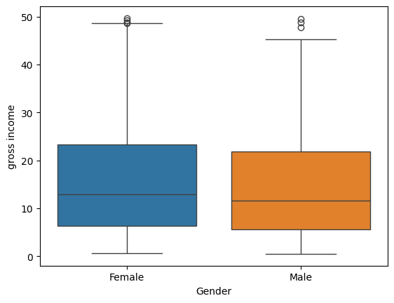
    


**Gross Income by Gender**

- Chart: Box plot.
- Observation: Both genders contribute similarly to gross income, with a slightly higher median for females.
- Insight: Marketing strategies can be uniformly applied across genders as both contribute equally to income.

**Question 4:** Is there a noticeable time trend in gross income?


```python
selected_columns = ['Unit price', 'Quantity', 'Tax 5%', 'Total', 'cogs', 'gross income', 'Rating']
df1 = df[selected_columns]
df1.groupby(df1.index).mean()
```


<div>

<table border="1" class="dataframe">
  <thead>
    <tr style="text-align: right;">
      <th></th>
      <th>Unit price</th>
      <th>Quantity</th>
      <th>Tax 5%</th>
      <th>Total</th>
      <th>cogs</th>
      <th>gross income</th>
      <th>Rating</th>
    </tr>
    <tr>
      <th>Date</th>
      <th></th>
      <th></th>
      <th></th>
      <th></th>
      <th></th>
      <th></th>
      <th></th>
    </tr>
  </thead>
  <tbody>
    <tr>
      <th>2019-01-01</th>
      <td>54.995833</td>
      <td>6.454545</td>
      <td>18.830083</td>
      <td>395.431750</td>
      <td>376.601667</td>
      <td>18.830083</td>
      <td>6.583333</td>
    </tr>
    <tr>
      <th>2019-01-02</th>
      <td>44.635000</td>
      <td>6.000000</td>
      <td>11.580375</td>
      <td>243.187875</td>
      <td>231.607500</td>
      <td>11.580375</td>
      <td>6.050000</td>
    </tr>
    <tr>
      <th>2019-01-03</th>
      <td>59.457500</td>
      <td>4.625000</td>
      <td>12.369813</td>
      <td>259.766062</td>
      <td>247.396250</td>
      <td>12.369813</td>
      <td>8.112500</td>
    </tr>
    <tr>
      <th>2019-01-04</th>
      <td>51.743333</td>
      <td>5.333333</td>
      <td>12.886417</td>
      <td>270.614750</td>
      <td>257.728333</td>
      <td>12.886417</td>
      <td>6.516667</td>
    </tr>
    <tr>
      <th>2019-01-05</th>
      <td>61.636667</td>
      <td>4.583333</td>
      <td>14.034458</td>
      <td>294.723625</td>
      <td>280.689167</td>
      <td>14.034458</td>
      <td>7.433333</td>
    </tr>
    <tr>
      <th>...</th>
      <td>...</td>
      <td>...</td>
      <td>...</td>
      <td>...</td>
      <td>...</td>
      <td>...</td>
      <td>...</td>
    </tr>
    <tr>
      <th>2019-03-26</th>
      <td>42.972308</td>
      <td>4.000000</td>
      <td>7.188692</td>
      <td>150.962538</td>
      <td>143.773846</td>
      <td>7.188692</td>
      <td>6.623077</td>
    </tr>
    <tr>
      <th>2019-03-27</th>
      <td>56.841000</td>
      <td>4.500000</td>
      <td>13.822950</td>
      <td>290.281950</td>
      <td>276.459000</td>
      <td>13.822950</td>
      <td>6.760000</td>
    </tr>
    <tr>
      <th>2019-03-28</th>
      <td>45.525000</td>
      <td>4.800000</td>
      <td>10.616200</td>
      <td>222.940200</td>
      <td>212.324000</td>
      <td>10.616200</td>
      <td>7.050000</td>
    </tr>
    <tr>
      <th>2019-03-29</th>
      <td>66.346250</td>
      <td>6.750000</td>
      <td>23.947875</td>
      <td>502.905375</td>
      <td>478.957500</td>
      <td>23.947875</td>
      <td>6.925000</td>
    </tr>
    <tr>
      <th>2019-03-30</th>
      <td>67.408182</td>
      <td>5.888889</td>
      <td>19.424500</td>
      <td>407.914500</td>
      <td>388.490000</td>
      <td>19.424500</td>
      <td>6.800000</td>
    </tr>
  </tbody>
</table>
<p>89 rows × 7 columns</p>
</div>


```python
sns.lineplot(x = df1.groupby(df1.index).mean().index, 
             y =df1.groupby(df1.index).mean()['gross income'])
```


    <Axes: xlabel='Date', ylabel='gross income'>


    
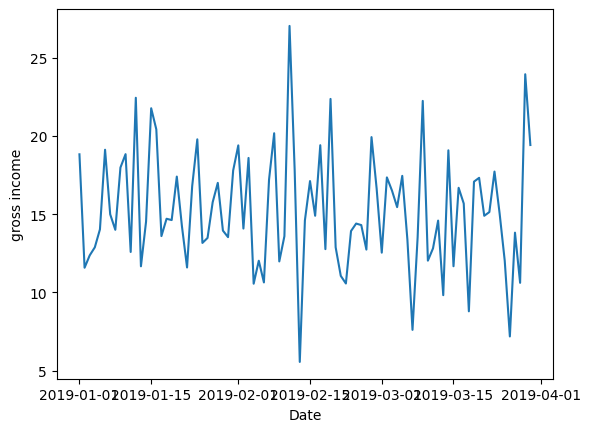
    


**Time Trend in Gross Income**

- Chart: Line plot for daily average gross income.
- Observation: There is no clear trend, but fluctuations indicate varying daily sales.
- Insight: Promotions or events on specific days could influence these fluctuations.


```python
#sns.pairplot(df1)
```

 

### Dealing With Duplicate Rows and Missing Values


```python
df.duplicated().sum()
```


    np.int64(3)


```python
df[df.duplicated() == True]
```


<div>

<table border="1" class="dataframe">
  <thead>
    <tr style="text-align: right;">
      <th></th>
      <th>Invoice ID</th>
      <th>Branch</th>
      <th>City</th>
      <th>Customer type</th>
      <th>Gender</th>
      <th>Product line</th>
      <th>Unit price</th>
      <th>Quantity</th>
      <th>Tax 5%</th>
      <th>Total</th>
      <th>Time</th>
      <th>Payment</th>
      <th>cogs</th>
      <th>gross margin percentage</th>
      <th>gross income</th>
      <th>Rating</th>
    </tr>
    <tr>
      <th>Date</th>
      <th></th>
      <th></th>
      <th></th>
      <th></th>
      <th></th>
      <th></th>
      <th></th>
      <th></th>
      <th></th>
      <th></th>
      <th></th>
      <th></th>
      <th></th>
      <th></th>
      <th></th>
      <th></th>
    </tr>
  </thead>
  <tbody>
    <tr>
      <th>2019-02-18</th>
      <td>849-09-3807</td>
      <td>A</td>
      <td>Yangon</td>
      <td>Member</td>
      <td>Female</td>
      <td>Fashion accessories</td>
      <td>88.34</td>
      <td>7.0</td>
      <td>30.919</td>
      <td>649.299</td>
      <td>13:28</td>
      <td>Cash</td>
      <td>618.38</td>
      <td>4.761905</td>
      <td>30.919</td>
      <td>6.6</td>
    </tr>
    <tr>
      <th>2019-03-10</th>
      <td>745-74-0715</td>
      <td>A</td>
      <td>Yangon</td>
      <td>Normal</td>
      <td>Male</td>
      <td>Electronic accessories</td>
      <td>NaN</td>
      <td>2.0</td>
      <td>5.803</td>
      <td>121.863</td>
      <td>20:46</td>
      <td>Ewallet</td>
      <td>116.06</td>
      <td>4.761905</td>
      <td>5.803</td>
      <td>8.8</td>
    </tr>
    <tr>
      <th>2019-01-26</th>
      <td>452-04-8808</td>
      <td>B</td>
      <td>Mandalay</td>
      <td>Normal</td>
      <td>Male</td>
      <td>Electronic accessories</td>
      <td>87.08</td>
      <td>NaN</td>
      <td>30.478</td>
      <td>640.038</td>
      <td>15:17</td>
      <td>Cash</td>
      <td>609.56</td>
      <td>4.761905</td>
      <td>30.478</td>
      <td>5.5</td>
    </tr>
  </tbody>
</table>
</div>


```python
df_cleaned = df.copy()
df_cleaned.drop_duplicates(inplace=True)
df_cleaned.duplicated().sum()
```


    np.int64(0)


Missing values 


```python
df_cleaned.isna().sum()
```


    Invoice ID                  0
    Branch                      0
    City                        0
    Customer type              79
    Gender                      0
    Product line               43
    Unit price                  6
    Quantity                   19
    Tax 5%                      0
    Total                       0
    Time                        0
    Payment                     0
    cogs                        0
    gross margin percentage     0
    gross income                0
    Rating                      0
    dtype: int64


```python
df_cleaned.isna().sum()/len(df_cleaned)
```


    Invoice ID                 0.000
    Branch                     0.000
    City                       0.000
    Customer type              0.079
    Gender                     0.000
    Product line               0.043
    Unit price                 0.006
    Quantity                   0.019
    Tax 5%                     0.000
    Total                      0.000
    Time                       0.000
    Payment                    0.000
    cogs                       0.000
    gross margin percentage    0.000
    gross income               0.000
    Rating                     0.000
    dtype: float64


```python
sns.heatmap(df.isna(), cbar=False)
```


    <Axes: ylabel='Date'>


    
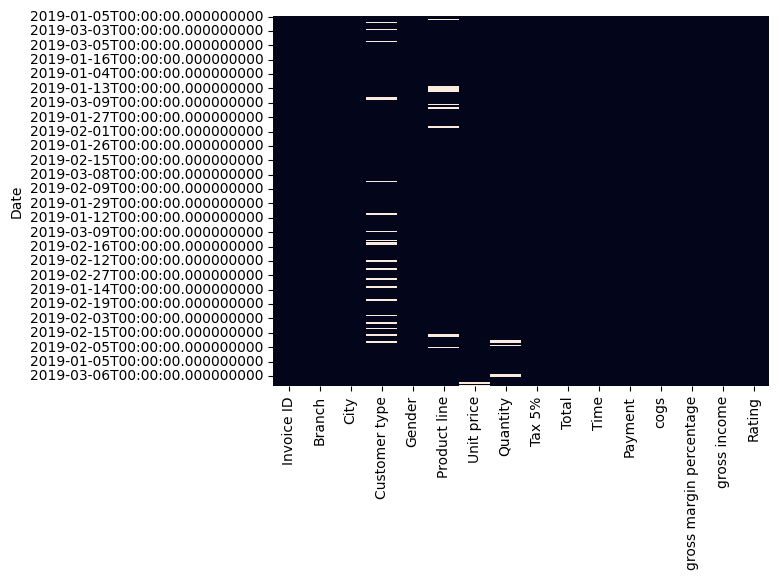
    


**Missing Values Heatmap**

- Chart: Heatmap of missing values.
- Observation: Customer type and Product line have some missing values.
- Insight: These missing values need to be handled to maintain data integrity.


```python
#df.fillna(0)
df_cleaned.fillna(df_cleaned[selected_columns].mean(), inplace=True) #selected_columns=all numeric columns
```


```python
df_cleaned.fillna(df_cleaned.mode().iloc[0], inplace=True)
```


```python
sns.heatmap(df_cleaned.isna(), cbar=False)
```


    <Axes: ylabel='Date'>


    
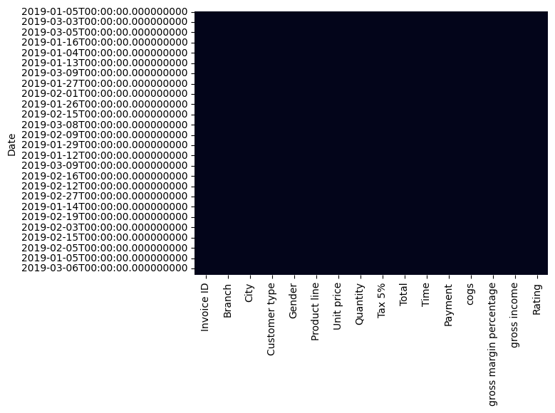
    


```python
df_cleaned
```


<div>

<table border="1" class="dataframe">
  <thead>
    <tr style="text-align: right;">
      <th></th>
      <th>Invoice ID</th>
      <th>Branch</th>
      <th>City</th>
      <th>Customer type</th>
      <th>Gender</th>
      <th>Product line</th>
      <th>Unit price</th>
      <th>Quantity</th>
      <th>Tax 5%</th>
      <th>Total</th>
      <th>Time</th>
      <th>Payment</th>
      <th>cogs</th>
      <th>gross margin percentage</th>
      <th>gross income</th>
      <th>Rating</th>
    </tr>
    <tr>
      <th>Date</th>
      <th></th>
      <th></th>
      <th></th>
      <th></th>
      <th></th>
      <th></th>
      <th></th>
      <th></th>
      <th></th>
      <th></th>
      <th></th>
      <th></th>
      <th></th>
      <th></th>
      <th></th>
      <th></th>
    </tr>
  </thead>
  <tbody>
    <tr>
      <th>2019-01-05</th>
      <td>750-67-8428</td>
      <td>A</td>
      <td>Yangon</td>
      <td>Member</td>
      <td>Female</td>
      <td>Health and beauty</td>
      <td>74.690000</td>
      <td>7.0</td>
      <td>26.1415</td>
      <td>548.9715</td>
      <td>13:08</td>
      <td>Ewallet</td>
      <td>522.83</td>
      <td>4.761905</td>
      <td>26.1415</td>
      <td>9.1</td>
    </tr>
    <tr>
      <th>2019-03-08</th>
      <td>226-31-3081</td>
      <td>C</td>
      <td>Naypyitaw</td>
      <td>Normal</td>
      <td>Female</td>
      <td>Electronic accessories</td>
      <td>15.280000</td>
      <td>5.0</td>
      <td>3.8200</td>
      <td>80.2200</td>
      <td>10:29</td>
      <td>Cash</td>
      <td>76.40</td>
      <td>4.761905</td>
      <td>3.8200</td>
      <td>9.6</td>
    </tr>
    <tr>
      <th>2019-03-03</th>
      <td>631-41-3108</td>
      <td>A</td>
      <td>Yangon</td>
      <td>Normal</td>
      <td>Male</td>
      <td>Home and lifestyle</td>
      <td>46.330000</td>
      <td>7.0</td>
      <td>16.2155</td>
      <td>340.5255</td>
      <td>13:23</td>
      <td>Credit card</td>
      <td>324.31</td>
      <td>4.761905</td>
      <td>16.2155</td>
      <td>7.4</td>
    </tr>
    <tr>
      <th>2019-01-27</th>
      <td>123-19-1176</td>
      <td>A</td>
      <td>Yangon</td>
      <td>Member</td>
      <td>Male</td>
      <td>Health and beauty</td>
      <td>58.220000</td>
      <td>8.0</td>
      <td>23.2880</td>
      <td>489.0480</td>
      <td>20:33</td>
      <td>Ewallet</td>
      <td>465.76</td>
      <td>4.761905</td>
      <td>23.2880</td>
      <td>8.4</td>
    </tr>
    <tr>
      <th>2019-02-08</th>
      <td>373-73-7910</td>
      <td>A</td>
      <td>Yangon</td>
      <td>Normal</td>
      <td>Male</td>
      <td>Sports and travel</td>
      <td>86.310000</td>
      <td>7.0</td>
      <td>30.2085</td>
      <td>634.3785</td>
      <td>10:37</td>
      <td>Ewallet</td>
      <td>604.17</td>
      <td>4.761905</td>
      <td>30.2085</td>
      <td>5.3</td>
    </tr>
    <tr>
      <th>...</th>
      <td>...</td>
      <td>...</td>
      <td>...</td>
      <td>...</td>
      <td>...</td>
      <td>...</td>
      <td>...</td>
      <td>...</td>
      <td>...</td>
      <td>...</td>
      <td>...</td>
      <td>...</td>
      <td>...</td>
      <td>...</td>
      <td>...</td>
      <td>...</td>
    </tr>
    <tr>
      <th>2019-01-29</th>
      <td>233-67-5758</td>
      <td>C</td>
      <td>Naypyitaw</td>
      <td>Normal</td>
      <td>Male</td>
      <td>Health and beauty</td>
      <td>55.700292</td>
      <td>1.0</td>
      <td>2.0175</td>
      <td>42.3675</td>
      <td>13:46</td>
      <td>Ewallet</td>
      <td>40.35</td>
      <td>4.761905</td>
      <td>2.0175</td>
      <td>6.2</td>
    </tr>
    <tr>
      <th>2019-03-02</th>
      <td>303-96-2227</td>
      <td>B</td>
      <td>Mandalay</td>
      <td>Normal</td>
      <td>Female</td>
      <td>Home and lifestyle</td>
      <td>55.700292</td>
      <td>10.0</td>
      <td>48.6900</td>
      <td>1022.4900</td>
      <td>17:16</td>
      <td>Ewallet</td>
      <td>973.80</td>
      <td>4.761905</td>
      <td>48.6900</td>
      <td>4.4</td>
    </tr>
    <tr>
      <th>2019-02-09</th>
      <td>727-02-1313</td>
      <td>A</td>
      <td>Yangon</td>
      <td>Member</td>
      <td>Male</td>
      <td>Food and beverages</td>
      <td>55.700292</td>
      <td>1.0</td>
      <td>1.5920</td>
      <td>33.4320</td>
      <td>13:22</td>
      <td>Cash</td>
      <td>31.84</td>
      <td>4.761905</td>
      <td>1.5920</td>
      <td>7.7</td>
    </tr>
    <tr>
      <th>2019-02-22</th>
      <td>347-56-2442</td>
      <td>A</td>
      <td>Yangon</td>
      <td>Normal</td>
      <td>Male</td>
      <td>Home and lifestyle</td>
      <td>65.820000</td>
      <td>1.0</td>
      <td>3.2910</td>
      <td>69.1110</td>
      <td>15:33</td>
      <td>Cash</td>
      <td>65.82</td>
      <td>4.761905</td>
      <td>3.2910</td>
      <td>4.1</td>
    </tr>
    <tr>
      <th>2019-02-18</th>
      <td>849-09-3807</td>
      <td>A</td>
      <td>Yangon</td>
      <td>Member</td>
      <td>Female</td>
      <td>Fashion accessories</td>
      <td>88.340000</td>
      <td>7.0</td>
      <td>30.9190</td>
      <td>649.2990</td>
      <td>13:28</td>
      <td>Cash</td>
      <td>618.38</td>
      <td>4.761905</td>
      <td>30.9190</td>
      <td>6.6</td>
    </tr>
  </tbody>
</table>
<p>1000 rows × 16 columns</p>
</div>


 

### Correlation Analysis


```python
round(np.corrcoef(df['gross income'], df['Rating'])[1][0],2)
```


    np.float64(-0.04)


```python
np.round(df1.corr(),2)
```


<div>

<table border="1" class="dataframe">
  <thead>
    <tr style="text-align: right;">
      <th></th>
      <th>Unit price</th>
      <th>Quantity</th>
      <th>Tax 5%</th>
      <th>Total</th>
      <th>cogs</th>
      <th>gross income</th>
      <th>Rating</th>
    </tr>
  </thead>
  <tbody>
    <tr>
      <th>Unit price</th>
      <td>1.00</td>
      <td>0.02</td>
      <td>0.63</td>
      <td>0.63</td>
      <td>0.63</td>
      <td>0.63</td>
      <td>-0.01</td>
    </tr>
    <tr>
      <th>Quantity</th>
      <td>0.02</td>
      <td>1.00</td>
      <td>0.71</td>
      <td>0.71</td>
      <td>0.71</td>
      <td>0.71</td>
      <td>-0.02</td>
    </tr>
    <tr>
      <th>Tax 5%</th>
      <td>0.63</td>
      <td>0.71</td>
      <td>1.00</td>
      <td>1.00</td>
      <td>1.00</td>
      <td>1.00</td>
      <td>-0.04</td>
    </tr>
    <tr>
      <th>Total</th>
      <td>0.63</td>
      <td>0.71</td>
      <td>1.00</td>
      <td>1.00</td>
      <td>1.00</td>
      <td>1.00</td>
      <td>-0.04</td>
    </tr>
    <tr>
      <th>cogs</th>
      <td>0.63</td>
      <td>0.71</td>
      <td>1.00</td>
      <td>1.00</td>
      <td>1.00</td>
      <td>1.00</td>
      <td>-0.04</td>
    </tr>
    <tr>
      <th>gross income</th>
      <td>0.63</td>
      <td>0.71</td>
      <td>1.00</td>
      <td>1.00</td>
      <td>1.00</td>
      <td>1.00</td>
      <td>-0.04</td>
    </tr>
    <tr>
      <th>Rating</th>
      <td>-0.01</td>
      <td>-0.02</td>
      <td>-0.04</td>
      <td>-0.04</td>
      <td>-0.04</td>
      <td>-0.04</td>
      <td>1.00</td>
    </tr>
  </tbody>
</table>
</div>


```python
sns.heatmap(np.round(df1.corr(),2), annot=True)
```


    <Axes: >


    
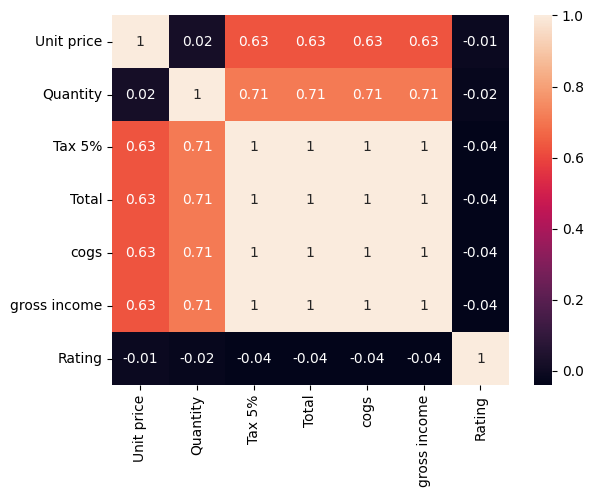
    


**Correlation Analysis**

- Chart: Heatmap of correlation matrix.
- Observation: High correlation between unit price, quantity, tax, total, COGS, and gross income.
- Insight: These variables are interdependent, which is expected in a retail dataset.


### Recommendations

- Customer Satisfaction: Focus on factors other than spending to improve ratings.
- Branch Performance: Investigate why Branch A performs better and apply successful strategies to other branches.
- Payment Methods: Ensure all payment options are available and possibly promote the use of underutilized methods like Credit Cards.
- Data Integrity: Address missing values in Customer type and Product line for accurate analysis.
